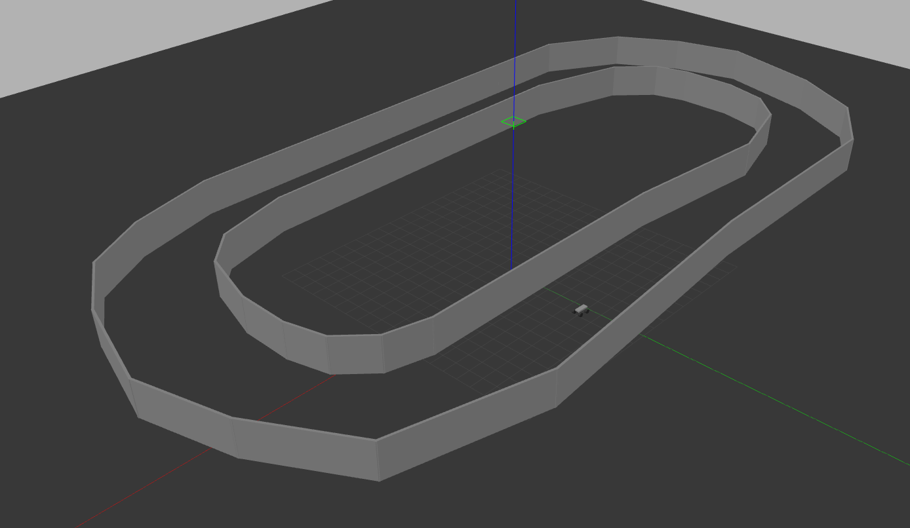
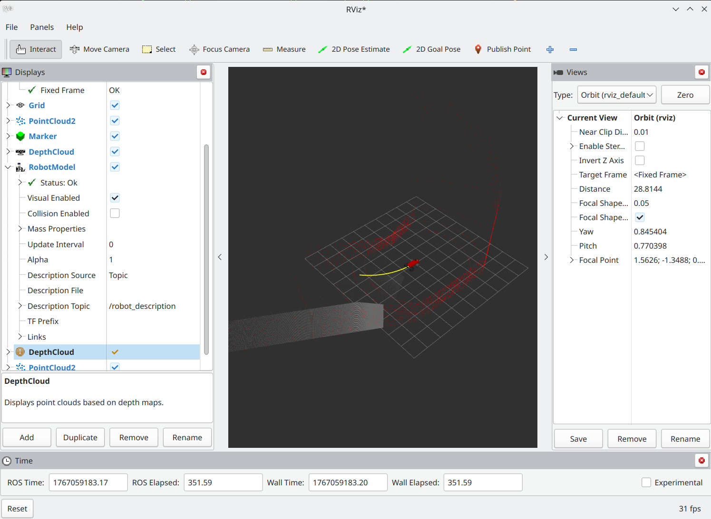

# Autonomous Ackermann Geometry Vehicle





[▶️ Watch demo video](testrunfull.mp4)

ROS2 Humble Ackermann vehicle implementation based off of default gazebo plugins. Includes a LIDAR and RGBD sensor for autonomous driving. Utilizes PID tuning and Kalman Filter for control optimization.

Credit to [@Hisham178](https://github.com/Hisham178) for the basic [Ackermann geometry vehicle](https://github.com/Hisham178/ros2_ackermann).

How to install.
1. Git clone and colcon.
2. Make sure to source your build including gazebo --> source /usr/share/gazebo/setup.sh
3. ```ros2 launch ackermann_gazebo bot.launch.py```
4. ```ros2 run autonomous_driver autonomous_driver``` or ```ros2 run autonomous_driver rgbd_driver``` or ```ros2 run autonomous_driver fusion_driver```

# To launch multi vehicle mode
```ros2 launch multirobot.launch.py```
or
```ros2 launch multifusion.launch.py```


